# ActionSheet 组件

一个高度可配置、符合SOLID原则的iOS ActionSheet组件，支持从源视图动画展开和收缩，具有完整的手势交互和高度自适应功能。

## ✨ 特性

- 🎯 **从源视图动画展开** - 支持从任意UI元素（如按钮、浮动视图）位置开始动画
- 🔄 **智能收缩动画** - 关闭时回到原始源视图样式，提供完整的视觉连续性
- 🎨 **高度可配置** - 源视图和结束视图的样式、动画都可以自定义
- 👆 **丰富手势交互** - 支持拖拽调整高度、背景点击关闭等
- 🏗️ **SOLID架构** - 遵循SOLID原则，易于扩展和维护
- 🎭 **多种预设场景** - 内置反馈、购物车、设置等常见使用场景

## 🏗️ 架构设计

### 完整架构设计图

```mermaid
graph TB
    subgraph "🏗️ Core Architecture - SOLID Principles"
        subgraph "📱 Presentation Layer"
            ASC[ActionSheetViewController<br/>🎯 主控制器<br/>• 协调各组件<br/>• 管理生命周期<br/>• 处理代理回调]
            FFC[FeedbackFormViewController<br/>📝 反馈表单<br/>• 星级评分<br/>• 文本输入<br/>• 提交处理]
        end

        subgraph "🎨 Animation Layer"
            AAM[ActionSheetAnimationManager<br/>🎬 动画管理<br/>• 展示动画<br/>• 收缩动画<br/>• 高度变化动画]
            subgraph "Animation Phases"
                PA[Presentation Animation<br/>1️⃣ 从源视图开始<br/>2️⃣ 扩展到目标尺寸<br/>3️⃣ 背景渐入]
                DA[Dismissal Animation<br/>1️⃣ 隐藏ActionSheet内容<br/>2️⃣ 显示感谢视图<br/>3️⃣ 收缩到源位置<br/>4️⃣ 最终消失]
            end
        end

        subgraph "👆 Interaction Layer"
            AGH[ActionSheetGestureHandler<br/>✋ 手势处理<br/>• 拖拽调整高度<br/>• 背景点击关闭<br/>• 边界检测]
            FFV[FloatingFeedbackView<br/>🎈 悬浮视图<br/>• 星级显示<br/>• 点击交互<br/>• 展开触发]
        end

        subgraph "⚙️ Configuration Layer"
            ASConfig[ActionSheetConfiguration<br/>🔧 配置管理<br/>• 动画参数<br/>• 视图样式<br/>• 行为设置]
            ASVC[ActionSheetViewConfiguration<br/>🎨 视图配置<br/>• 源视图样式<br/>• 结束视图样式<br/>• 动画时序]
        end
    end

    subgraph "🔌 Protocol Layer - Interface Segregation"
        ASP[ActionSheetPresentable<br/>📋 主协议]
        ASD[ActionSheetDelegate<br/>📞 事件回调]
        ASA[ActionSheetAnimatable<br/>🎭 动画协议]
        ASGH[ActionSheetGestureHandling<br/>👋 手势协议]
        SVC[SourceViewConfigurable<br/>🎯 源视图配置]
        DVC[DismissalViewConfigurable<br/>🏁 结束视图配置]
    end

    subgraph "🎯 Demo Scenarios"
        subgraph "💬 Feedback Scenario"
            FM[FeedbackManager<br/>📊 反馈管理<br/>• 状态管理<br/>• 数据收集<br/>• 流程控制]
            FS[Floating → Expanded → Thank You<br/>🎈 → 📝 → ✅]
        end



        subgraph "🛒 Shopping Cart Scenario"
            SCS[Cart → Order → Confirmation<br/>🛒 → 📋 → ✅]
        end

        subgraph "⚙️ Settings Scenario"
            SS[Settings → Configure → Save<br/>⚙️ → 🔧 → 💾]
        end
    end

    subgraph "🔧 Extension Points - Open/Closed Principle"
        subgraph "🎨 Custom Animations"
            CAM[CustomAnimationManager<br/>🎪 自定义动画<br/>• 实现ASA协议<br/>• 特殊效果<br/>• 品牌定制]
        end

        subgraph "👆 Custom Gestures"
            CGH[CustomGestureHandler<br/>🤏 自定义手势<br/>• 实现ASGH协议<br/>• 特殊交互<br/>• 无障碍支持]
        end

        subgraph "🎯 Custom Views"
            CSV[CustomSourceView<br/>🎨 自定义源视图<br/>• 实现SVC协议<br/>• 品牌样式<br/>• 特殊形状]
            CDV[CustomDismissalView<br/>🏁 自定义结束视图<br/>• 实现DVC协议<br/>• 个性化反馈<br/>• 动态内容]
        end
    end

    %% 核心关系
    ASC --> AAM
    ASC --> AGH
    ASC --> ASConfig
    ASC --> ASVC

    AAM --> PA
    AAM --> DA

    FM --> ASC
    FM --> FFV
    FM --> FFC

    %% 协议实现
    ASC -.-> ASP
    ASC -.-> ASD
    AAM -.-> ASA
    AGH -.-> ASGH
    ASConfig -.-> SVC
    ASVC -.-> DVC

    %% 扩展关系
    CAM -.-> ASA
    CGH -.-> ASGH
    CSV -.-> SVC
    CDV -.-> DVC

    %% 场景关系
    FM --> FS

    %% 样式定义
    classDef coreClass fill:#e3f2fd,stroke:#1976d2,stroke-width:2px
    classDef protocolClass fill:#f3e5f5,stroke:#7b1fa2,stroke-width:2px
    classDef animationClass fill:#e8f5e8,stroke:#388e3c,stroke-width:2px
    classDef configClass fill:#fff3e0,stroke:#f57c00,stroke-width:2px
    classDef demoClass fill:#fce4ec,stroke:#c2185b,stroke-width:2px
    classDef extensionClass fill:#f1f8e9,stroke:#689f38,stroke-width:2px

    class ASC,AAM,AGH,ASConfig,ASVC,FFC,FFV coreClass
    class ASP,ASD,ASA,ASGH,SVC,DVC protocolClass
    class PA,DA animationClass
    class ASConfig,ASVC configClass
    class FM,FS,SCS,SS demoClass
    class CAM,CGH,CSV,CDV extensionClass
```



### 核心组件

```
ActionSheetViewController (主控制器)
├── ActionSheetAnimationManager (动画管理)
├── ActionSheetGestureHandler (手势处理)
└── ActionSheetConfiguration (配置管理)
```

### 协议设计

- **ActionSheetPresentable** - 主要协议，定义展示和交互接口
- **ActionSheetConfigurable** - 配置协议，定义所有可配置属性
- **ActionSheetAnimatable** - 动画协议，定义动画相关方法
- **ActionSheetGestureHandling** - 手势协议，定义手势处理方法
- **SourceViewConfigurable** - 源视图配置协议
- **DismissalViewConfigurable** - 结束视图配置协议

### SOLID原则实现

1. **单一职责原则 (SRP)** - 每个类只负责一个功能
   - `ActionSheetViewController`: 协调各组件
   - `ActionSheetAnimationManager`: 处理动画逻辑
   - `ActionSheetGestureHandler`: 管理手势交互
   - `ActionSheetConfiguration`: 存储配置信息

2. **开闭原则 (OCP)** - 通过协议扩展，对修改关闭，对扩展开放
   - 新的动画效果可以通过实现`ActionSheetAnimatable`协议添加
   - 新的配置选项可以通过扩展配置协议添加

3. **里氏替换原则 (LSP)** - 所有实现都可以替换协议
   - 任何实现了`ActionSheetPresentable`的类都可以替换默认实现

4. **接口隔离原则 (ISP)** - 协议职责明确，不强制实现不需要的方法
   - 分离了配置、动画、手势等不同职责的协议

5. **依赖倒置原则 (DIP)** - 依赖抽象而不是具体实现
   - 通过`SourceViewProvider`和`DismissalViewProvider`协议提供自定义实现

## 🚀 快速开始

### 基本使用

```swift
// 1. 创建配置
let config = ActionSheetConfiguration.default

// 2. 创建ActionSheet
let actionSheet = ActionSheetViewController(configuration: config)
actionSheet.delegate = self

// 3. 设置内容
let contentVC = YourContentViewController()
actionSheet.setContentViewController(contentVC)

// 4. 展示
actionSheet.present(from: self, animated: true)
```

### 从源视图展开

```swift
// 从特定视图（如按钮）位置展开
actionSheet.present(from: self, sourceView: yourButton, animated: true)
```

### 自定义配置

```swift
let customConfig = ActionSheetConfigurationBuilder()
    .defaultHeight(300)
    .maxHeight(600)
    .animationDuration(0.4)
    .backgroundColor(.systemBackground)
    .build()

let actionSheet = ActionSheetViewController(configuration: customConfig)
```

## 📱 使用场景

### 1. 💬 反馈场景
从悬浮反馈视图展开到详细表单，完成后显示感谢信息

```swift
// 反馈管理器会自动处理从浮动视图到详细表单的转换
let feedbackManager = FeedbackManager()
feedbackManager.delegate = self
feedbackManager.showFloatingFeedback(in: self)

// 实现代理方法
extension YourViewController: FeedbackManagerDelegate {
    func feedbackManager(_ manager: FeedbackManager, didSubmitFeedback feedback: FeedbackData) {
        print("收到反馈: \(feedback)")
    }
}
```

**特点**:
- 🎈 悬浮视图 → 📝 详细表单 → ✅ 感谢反馈
- 自动状态管理和数据收集
- 流畅的视觉连续性

### 2. 🛒 购物车场景
从购物车按钮展开到订单详情，提交后显示确认信息

```swift
let cartConfig = ActionSheetUsageExamples.createShoppingCartActionSheet()
let actionSheet = ActionSheetViewController(configuration: cartConfig)

// 设置购物车内容
let cartContentVC = ShoppingCartViewController()
actionSheet.setContentViewController(cartContentVC)
actionSheet.present(from: self, sourceView: cartButton, animated: true)
```

**特点**:
- 🛒 购物车按钮 → 📋 订单详情 → ✅ 订单确认
- 支持商品列表、价格计算、支付流程
- 自定义结束视图样式

### 3. ⚙️ 设置场景
从设置按钮展开到配置选项，保存后显示确认

```swift
let settingsConfig = ActionSheetUsageExamples.createSettingsActionSheet()
let actionSheet = ActionSheetViewController(configuration: settingsConfig)

// 设置配置内容
let settingsContentVC = SettingsViewController()
actionSheet.setContentViewController(settingsContentVC)
actionSheet.present(from: self, sourceView: settingsButton, animated: true)
```

**特点**:
- ⚙️ 设置按钮 → 🔧 配置选项 → 💾 保存确认
- 快速动画，紧凑样式
- 适合简单配置场景

### 4. 🎵 媒体播放器场景
从播放按钮展开到播放列表，操作后显示播放状态

```swift
let mediaConfig = ActionSheetUsageExamples.createMediaPlayerActionSheet()
let actionSheet = ActionSheetViewController(configuration: mediaConfig)

// 设置媒体内容
let playlistVC = PlaylistViewController()
actionSheet.setContentViewController(playlistVC)
actionSheet.present(from: self, sourceView: playButton, animated: true)
```

**特点**:
- 🎵 播放按钮 → 📱 播放列表 → 🎶 播放状态
- 华丽的动画效果和阴影
- 适合娱乐类应用


## 🎨 自定义配置

### 结束视图配置

```swift
// 自定义结束视图内容
let dismissalContent = DismissalViewContent(
    text: "操作完成",
    emoji: "✅",
    textColor: .systemGreen,
    font: .systemFont(ofSize: 16, weight: .semibold)
)

// 自定义结束视图样式
let dismissalStyle = DismissalViewStyle(
    backgroundColor: .systemBackground,
    cornerRadius: 20,
    shadowConfig: ShadowConfiguration(
        color: .black,
        opacity: 0.15,
        offset: CGSize(width: 0, height: 4),
        radius: 12
    ),
    padding: UIEdgeInsets(top: 12, left: 16, bottom: 12, right: 16)
)

// 自定义动画配置
let animationConfig = DismissalAnimationConfiguration(
    contentHideDuration: 0.4,
    tempViewShowDuration: 0.2,
    shrinkDuration: 0.6,
    finalFadeDuration: 0.3,
    pauseDuration: 0.1
)

let dismissalConfig = DismissalViewConfigurationBuilder()
    .content(dismissalContent)
    .style(dismissalStyle)
    .animationConfig(animationConfig)
    .build()
```

### 源视图配置

```swift
// 自定义源视图提供者
class CustomSourceViewProvider: SourceViewProvider {
    func createSourceView() -> UIView {
        // 创建自定义源视图
    }
    
    func getSourceViewConfiguration() -> SourceViewConfigurable {
        // 返回源视图配置
    }
}
```

## 🔧 扩展指南

### 添加新的动画效果

1. 实现`ActionSheetAnimatable`协议：

```swift
class CustomAnimationManager: ActionSheetAnimatable {
    func animatePresentation(completion: ((Bool) -> Void)?) {
        // 实现自定义展示动画
    }
    
    func animateDismissal(completion: ((Bool) -> Void)?) {
        // 实现自定义关闭动画
    }
    
    func animateToHeight(_ height: CGFloat, completion: ((Bool) -> Void)?) {
        // 实现自定义高度变化动画
    }
}
```

2. 在ActionSheetViewController中使用：

```swift
let actionSheet = ActionSheetViewController(configuration: config)
// 替换默认动画管理器
actionSheet.animationManager = CustomAnimationManager(configuration: config)
```

### 添加新的手势交互

1. 实现`ActionSheetGestureHandling`协议：

```swift
class CustomGestureHandler: ActionSheetGestureHandling {
    func handlePanGesture(_ gesture: UIPanGestureRecognizer) {
        // 实现自定义手势处理
    }
    
    func shouldTransitionToHeight(_ targetHeight: CGFloat, from currentHeight: CGFloat) -> CGFloat {
        // 实现自定义高度转换逻辑
    }
}
```

### 添加新的配置选项

1. 扩展配置协议：

```swift
protocol CustomActionSheetConfigurable: ActionSheetConfigurable {
    var customProperty: CustomType { get }
}
```

2. 实现配置结构：

```swift
struct CustomActionSheetConfiguration: CustomActionSheetConfigurable {
    // 实现所有必需的属性
    let customProperty: CustomType
    // ... 其他属性
}
```

## 📋 代理方法

### ActionSheetDelegate

```swift
extension YourViewController: ActionSheetDelegate {
    func actionSheetWillPresent(_ actionSheet: ActionSheetPresentable) {
        // ActionSheet即将展示
    }
    
    func actionSheetDidPresent(_ actionSheet: ActionSheetPresentable) {
        // ActionSheet已经展示
    }
    
    func actionSheetWillDismiss(_ actionSheet: ActionSheetPresentable) {
        // ActionSheet即将关闭
    }
    
    func actionSheetDidDismiss(_ actionSheet: ActionSheetPresentable) {
        // ActionSheet已经关闭
    }
    
    func actionSheet(_ actionSheet: ActionSheetPresentable, didChangeHeight height: CGFloat) {
        // ActionSheet高度发生变化
    }
}
```

### FeedbackManagerDelegate

```swift
extension YourViewController: FeedbackManagerDelegate {
    func feedbackManager(_ manager: FeedbackManager, didSubmitFeedback feedback: FeedbackData) {
        // 处理反馈提交
    }
    
    func feedbackManagerDidCancel(_ manager: FeedbackManager) {
        // 处理反馈取消
    }
}
```

### 🐛 常见问题排查


#### 问题1: 动画不流畅
**可能原因**: 在动画过程中进行了复杂的布局计算
**解决方案**: 将复杂操作移到动画完成后执行

#### 问题2: 手势冲突
**可能原因**: 内容视图的手势与ActionSheet手势冲突
**解决方案**: 正确设置手势的优先级和依赖关系

## 🎯 最佳实践

### 📐 高度设置
1. **合理的初始高度** - 根据主要内容设置，避免过大或过小
2. **适当的最大高度** - 通常不超过屏幕高度的80%
3. **考虑安全区域** - 在iPhone X系列设备上预留底部安全区域

### 🎨 动画优化
1. **避免复杂计算** - 不在动画过程中进行复杂的布局计算
2. **合理的动画时长** - 通常0.3-0.5秒比较合适
3. **使用弹性动画** - 适当的弹性效果能提升用户体验

### 👆 交互设计
1. **清晰的视觉反馈** - 确保用户知道可以拖拽调整高度
2. **合理的手势区域** - 拖拽区域不要太小
3. **边界处理** - 在达到最大/最小高度时提供适当反馈

### 🔧 性能优化
1. **懒加载内容** - 对于复杂内容使用懒加载
2. **复用视图** - 对于列表类内容考虑使用UITableView或UICollectionView
3. **内存管理** - 及时释放不需要的资源

## 📄 许可证

MIT License - 详见 LICENSE 文件

## 🤝 贡献

欢迎提交 Issue 和 Pull Request 来改进这个组件！
